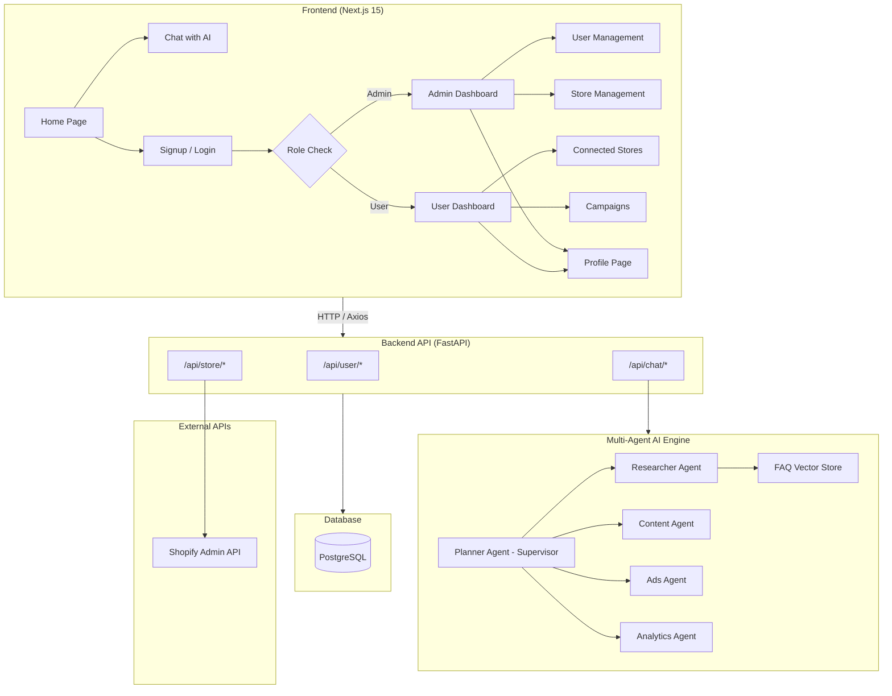
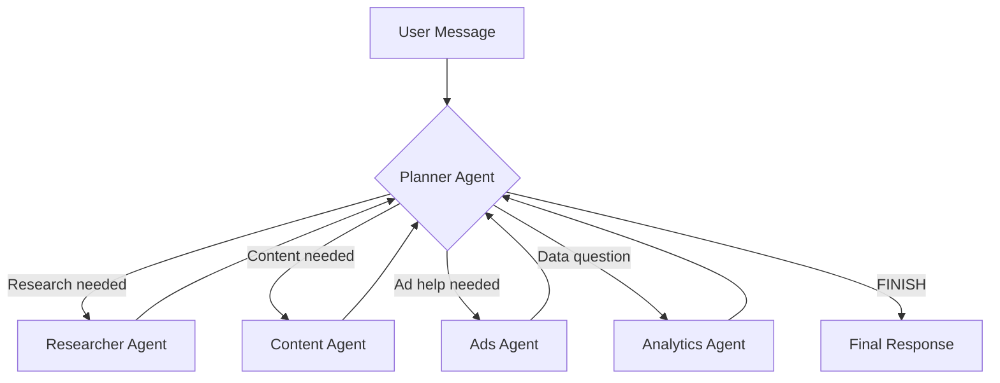
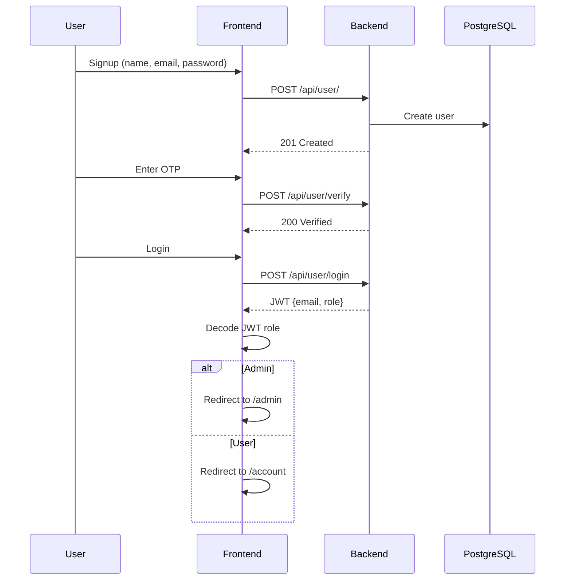

# 📚 MyBotify – Project Documentation

> **MyBotify AI** is a Shopify-integrated marketing platform that uses AI-driven automation to help users create, manage, and optimize marketing campaigns across Facebook, Instagram, and Google.

---

## 🏗️ High-Level Architecture

The project is a **monorepo** with two independent applications:

| Component | Directory | Tech Stack | Port |
|-----------|-----------|------------|------|
| **Backend API** | `mybotify-llm-dev/` | Python · FastAPI · PostgreSQL · LangChain/LangGraph · Gemini AI | `8000` |
| **Frontend UI** | `mybotify_ai/` | TypeScript · Next.js 15 · React 19 · TailwindCSS | `3000` |



---

## 📂 Project Structure

### Backend – `mybotify-llm-dev/`

```
mybotify-llm-dev/
├── main.py                    # Entry point – runs Uvicorn server
├── app/
│   ├── __init__.py            # FastAPI app factory (create_app)
│   ├── api/
│   │   ├── __init__.py        # Exports: chat, user, store routers
│   │   ├── docs.py            # OpenAPI tags metadata
│   │   ├── user/
│   │   │   ├── routes.py      # User + Admin endpoints
│   │   │   ├── schema.py      # Pydantic request/response models
│   │   │   ├── service.py     # Business logic (register, login, reset)
│   │   │   └── utils.py       # User-specific helpers
│   │   ├── chat/
│   │   │   ├── routes.py      # Chat endpoints (conversation, stream)
│   │   │   ├── conversation.py # Multi-agent graph (LangGraph + Gemini)
│   │   │   ├── agents/        # Specialized AI agents
│   │   │   │   ├── state.py   # AgentState (messages + next_agent)
│   │   │   │   ├── planner.py # Supervisor – routes to workers
│   │   │   │   ├── researcher.py # Research & Shopify info
│   │   │   │   ├── content.py # Copywriting & creative
│   │   │   │   ├── ads.py     # Ad campaigns & targeting
│   │   │   │   └── analytics.py # Metrics & data insights
│   │   │   └── utils/         # Chat models, config, persistence
│   │   └── store/
│   │       ├── routes.py      # Shopify store endpoints
│   │       ├── service.py     # Shopify API integration
│   │       └── utils/
│   │           └── schema.py  # Store request/response models
│   ├── core/
│   │   ├── config.py          # App settings (Pydantic BaseSettings)
│   │   ├── database/          # SQLAlchemy engine, session, pool
│   │   ├── email/             # SMTP email service (OTP)
│   │   └── middleware/
│   │       └── auth.py        # JWT auth + require_admin guard
│   ├── models/
│   │   ├── User.py            # User model (roles: USER/ADMIN/MODERATOR)
│   │   └── Store.py           # Store model (Shopify store details)
│   └── utils/
│       └── jwt.py             # JWT create/verify (includes role)
├── FAQs.json                  # FAQ knowledge base for AI chatbot
├── alembic/                   # Database migrations
├── Dockerfile                 # Docker container definition
└── requirements.txt           # Python dependencies
```

### Frontend – `mybotify_ai/`

```
mybotify_ai/
├── app/                       # Next.js App Router pages
│   ├── page.tsx               # Home page (landing)
│   ├── layout.tsx             # Root layout (Geist fonts)
│   ├── signup/                # Signup page
│   ├── account/               # User dashboard
│   ├── admin/                 # Admin dashboard
│   ├── profile/               # Profile editing
│   ├── chat/                  # AI Chat page
│   ├── domain/                # Domain management
│   ├── campagin/              # Campaign management
│   ├── website/               # Website page
│   └── about-us/              # About Us page
├── components/
│   ├── admin/                 # Admin-only components
│   │   ├── admin_dashboard.tsx # Admin layout + auth guard
│   │   ├── admin_sidebar.tsx  # Dashboard/Users/Stores/Profile tabs
│   │   ├── admin_stats.tsx    # Stats cards (users, admins, signups)
│   │   ├── users_table.tsx    # User management table
│   │   └── stores_table.tsx   # All connected stores table
│   ├── account/               # User account components
│   │   ├── account_tab/content.tsx # Connected stores list
│   │   ├── connect_store_modal.tsx # Connect Shopify store modal
│   │   └── common/side_bar.tsx    # User sidebar (logout, profile)
│   ├── profile/
│   │   └── profile_page.tsx   # Edit name, phone, password
│   ├── home/
│   │   ├── home.tsx           # Landing page
│   │   └── login_popup.tsx    # Login modal (role-based redirect)
│   ├── chat/                  # Chat components
│   ├── signup/                # Signup form components
│   ├── common/                # Header, footer, country selector
│   └── ui/                    # shadcn/ui primitives
├── api/                       # API client layer
│   ├── api.ts                 # Axios instance
│   ├── api_error.ts           # Error handler
│   ├── login.ts               # Login, password reset
│   ├── signup.ts              # Registration
│   ├── verify_otp.ts          # OTP verification
│   ├── chat.ts                # Chat API
│   ├── admin.ts               # Admin endpoints (users CRUD)
│   ├── store.ts               # Shopify store endpoints
│   └── profile.ts             # Profile get/update
├── lib/
│   ├── auth.ts                # JWT decode, getUserRole, isAdmin
│   └── utils.ts               # General helpers
└── .env.local                 # Frontend env vars
```

---

## 🔑 Key Features

### 1. User Authentication & Role-Based Access

| Feature | Backend Endpoint | Frontend Page |
|---------|-----------------|---------------|
| Registration | `POST /api/user/` | `/signup` |
| Email OTP Verification | `POST /api/user/verify` | `/signup` |
| Login (JWT with role) | `POST /api/user/login` | Login popup |
| Get Current User | `GET /api/user/me` | `/profile` |
| Update Profile | `PATCH /api/user/me` | `/profile` |
| Password Reset | `POST /api/user/reset-password/*` | Login popup |

**Auth flow**: Registration → Email OTP → Login → JWT (24h, includes `role`) → Role-based redirect (admin→`/admin`, user→`/account`)

**Roles**: `USER`, `ADMIN`, `MODERATOR` (Enum in `UserRole`)

### 2. Admin Dashboard (`/admin`)

| Feature | Endpoint | Description |
|---------|----------|-------------|
| View all users | `GET /api/user/all` | Table with search, role, status |
| Change user role | `PATCH /api/user/{id}/role` | Dropdown: user/admin/moderator |
| Toggle active | `PATCH /api/user/{id}/active` | Activate/deactivate users |
| View all stores | `GET /api/store/all` | All connected Shopify stores |
| Stats dashboard | — | Total users, active, admins, signups |

Protected by `require_admin` middleware — non-admins get `403`.

### 3. Shopify Store Integration

| Feature | Endpoint | Description |
|---------|----------|-------------|
| Connect store | `POST /api/store/connect` | Validates token with Shopify API |
| My stores | `GET /api/store/my-stores` | User's connected stores |
| All stores | `GET /api/store/all` | Admin view of all stores |
| Disconnect | `DELETE /api/store/{id}` | Remove a store |

**Flow**: User enters store URL + Admin API access token → Backend calls Shopify Admin API (`/admin/api/2024-01/shop.json`) → Fetches store name, domain, email, plan, currency, country → Saves to `stores` table.

### 4. Multi-Agent AI Chatbot

The AI system uses a **multi-agent architecture** built with LangGraph:



| Agent | Specialty |
|-------|-----------|
| **Planner** (Supervisor) | Routes user queries to the right worker agent. Synthesizes final responses |
| **Researcher** | Factual info, Shopify integrations, how MyBotify works |
| **Content** | Copywriting, ad copy, email templates, social media captions |
| **Ads** | Ad campaigns, budgets, targeting, platform selection (FB, IG, Google, TikTok) |
| **Analytics** | Metrics interpretation: ROAS, CTR, CPA, conversion rates |

**Key details:**
- **LLM**: Google Gemini 2.0 Flash via LangChain
- **Knowledge Base**: FAQs from `FAQs.json` embedded in an in-memory vector store using `GoogleGenerativeAIEmbeddings`
- **Persistence**: Conversation history in PostgreSQL via LangGraph `AsyncPostgresSaver`
- **Streaming**: SSE (Server-Sent Events) for real-time responses
- **Guest Limit**: After 3 messages, guests are prompted to sign up

### 5. Campaign & Domain Management
- Frontend pages exist for **Campaign** (`/campagin`) and **Domain** (`/domain`)
- UI components with forms, but backend integration is in progress

---

## 🗄️ Database

| Attribute | Value |
|-----------|-------|
| **Engine** | PostgreSQL |
| **ORM** | SQLAlchemy 2.0 + SQLModel |
| **Migrations** | Alembic |
| **Connection Pool** | `psycopg_pool` (async) |

### `users` table

| Column | Type | Notes |
|--------|------|-------|
| `id` | Integer | Primary key |
| `name` | String | Indexed |
| `role` | Enum(USER, ADMIN, MODERATOR) | Default: USER |
| `email` | String | Unique, indexed |
| `phone_number` | BigInteger | Unique, nullable |
| `is_active` | Boolean | Default: True |
| `hashed_password` | String | bcrypt hashed |
| `email_verification` | String | OTP token, nullable |
| `reset_password_code` | String | Nullable |
| `created_at` / `updated_at` | DateTime | Auto UTC |

### `stores` table

| Column | Type | Notes |
|--------|------|-------|
| `id` | Integer | Primary key |
| `user_id` | Integer | FK → users.id |
| `store_name` | String | From Shopify API |
| `store_url` | String | e.g. mystore.myshopify.com |
| `shopify_domain` | String | Primary domain |
| `shopify_email` | String | Store contact email |
| `shopify_plan` | String | e.g. "Basic Shopify" |
| `currency` / `country` | String | Store locale |
| `access_token` | Text | Shopify Admin API token |
| `is_active` | Boolean | Default: True |
| `connected_at` / `updated_at` | DateTime | Auto UTC |

---

## ⚙️ Environment Variables

### Backend (`.env`)

| Variable | Description |
|----------|-------------|
| `PYTHON_ENV` | `development` or `production` |
| `DATABASE_URL` | PostgreSQL connection string |
| `JWT_SECRET_KEY` | Secret for JWT signing |
| `CHAT_MODEL` | `gemini-2.0-flash` |
| `CHAT_PROVIDER` | `google_genai` |
| `CHAT_API_KEY` | Google AI API key |
| `SMTP_HOST` / `SMTP_PORT` | Email SMTP server |
| `SMTP_FROM_EMAIL` / `SMTP_USERNAME` / `SMTP_PASSWORD` | Email credentials |

### Frontend (`.env.local`)

| Variable | Description |
|----------|-------------|
| `NEXT_PUBLIC_API_BASE_URL` | `http://localhost:8000` |

---

## 🚀 How to Run Locally

### Prerequisites
- Python 3.9+, Node.js 18+, PostgreSQL

### 1. Start the Backend

```bash
cd mybotify-llm-dev
python -m venv venv
venv\Scripts\activate          # Windows
pip install -r requirements.txt
alembic upgrade head
python main.py
# → API at http://localhost:8000
# → Swagger at http://localhost:8000/docs
```

### 2. Start the Frontend

```bash
cd mybotify_ai
npm install
npm run dev
# → App at http://localhost:3000
```

---

## 🔐 Authentication Flow



---

## 📋 API Quick Reference

### User Endpoints (`/api/user`)

| Method | Path | Auth | Description |
|--------|------|------|-------------|
| `POST` | `/` | ❌ | Register new user |
| `POST` | `/verify` | ❌ | Verify email OTP |
| `POST` | `/login` | ❌ | Login, returns JWT with role |
| `GET` | `/me` | ✅ | Get current user info |
| `PATCH` | `/me` | ✅ | Update profile |
| `POST` | `/reset-password/request` | ❌ | Request password reset |
| `POST` | `/reset-password/confirm` | ❌ | Confirm password reset |
| `POST` | `/resend-verification` | ❌ | Resend verification email |
| `GET` | `/all` | 🔒 Admin | List all users |
| `PATCH` | `/{id}/role` | 🔒 Admin | Change user role |
| `PATCH` | `/{id}/active` | 🔒 Admin | Toggle active status |

### Chat Endpoints (`/api/chat`)

| Method | Path | Auth | Description |
|--------|------|------|-------------|
| `POST` | `/conversation` | ❌ | Send message, get full reply |
| `POST` | `/conversation/stream` | ❌ | Send message, get SSE stream |

### Store Endpoints (`/api/store`)

| Method | Path | Auth | Description |
|--------|------|------|-------------|
| `POST` | `/connect` | ✅ | Connect Shopify store |
| `GET` | `/my-stores` | ✅ | Get user's stores |
| `GET` | `/all` | 🔒 Admin | Get all stores |
| `DELETE` | `/{id}` | ✅ | Disconnect a store |

---

## 🗺️ Frontend Page Routes

| Route | Page | Access | Description |
|-------|------|--------|-------------|
| `/` | Home | Public | Landing page with AI chat preview |
| `/signup` | Signup | Public | Registration + OTP verification |
| `/account` | User Dashboard | 🔒 Auth | Connected stores, manage accounts |
| `/admin` | Admin Dashboard | 🔒 Admin | Users, stores, stats management |
| `/profile` | Profile | 🔒 Auth | Edit name, phone, change password |
| `/chat` | Chat | Public | Full AI chatbot interface |
| `/domain` | Domain | 🔒 Auth | Domain management |
| `/campagin` | Campaign | 🔒 Auth | Campaign creation & management |
| `/website` | Website | 🔒 Auth | Website configuration |
| `/about-us` | About Us | Public | Company information |

---

## 📦 Key Dependencies

### Backend (Python)

| Package | Purpose |
|---------|---------|
| `fastapi` + `uvicorn` | Web framework + ASGI server |
| `SQLAlchemy` + `sqlmodel` | ORM & database models |
| `alembic` | Database migrations |
| `langchain` + `langgraph` | Multi-agent AI framework |
| `langchain-google-genai` | Gemini LLM integration |
| `PyJWT` | JWT token handling |
| `passlib` + `bcrypt` | Password hashing |
| `requests` | Shopify API calls |

### Frontend (Node.js)

| Package | Purpose |
|---------|---------|
| `next` (v15) + `react` (v19) | React framework |
| `tailwindcss` | Utility-first CSS |
| `axios` | HTTP client |
| `react-hook-form` | Form management |
| `@radix-ui/*` | Accessible UI primitives |
| `react-icons` + `lucide-react` | Icon libraries |

---

## 🌐 Deployment

| Target | Method | Config |
|--------|--------|--------|
| **Backend** | Docker / Render | `Dockerfile`, `Procfile` |
| **Frontend** | Cloudflare Pages | `wrangler.jsonc`, `open-next.config.ts` |
